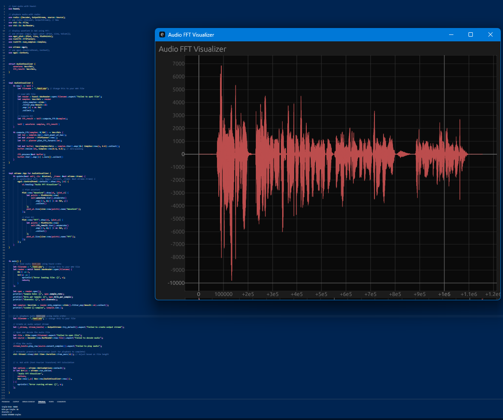

# A01-2025-02-03-February-Week02-Rust-Dissertation-ChatGPT

## Acknowledgements

Thanks to my Supervisor Prof J. J. Collins and Secondary Reader Prof Tabea DeWille in the [Department of Computer Science and Information Systems](https://www.ul.ie/scieng/schools-and-departments/department-computer-science-and-information-systems) in the Faculty of Science and Engineering at the University of Limerick. 

## Note on Repository

This Repository is Version 02, cloned from orignal Version (01) A01-2025-02-03-February-Week02-Rust-Dissertation-ChatGPT developed as part of my Dissertation.

## Description

Using Rust to do simple Audio Processing, using Full AI.

## Content




```bash
cd midi*/src

cargo update

cargo build

cargo run
```

_____

To output structure in `git bash` run:

```bash
git ls-files | grep '^src/'
```
