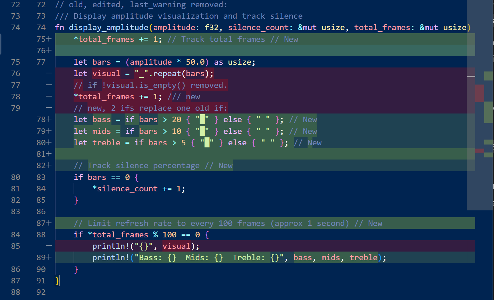

# ChatGPT

## Out

### Text

Summary of Updates:
Live Amplitude Visualization - Introduced a 3-band EQ-like display (Bass, Mids, Treble).
Refresh Rate Control - Prints only every 100 frames (~1 second).
Silence Tracking - Counts silent frames and integrates with start_timer().
Minimal Change Strategy - Avoided breaking existing logic.
Next Steps:
Validation: Run and test amplitude display.
Fine-tuning: Adjust Bass, Mids, and Treble sensitivity.
Review Silence Reporting: Ensure silent percentage tracking aligns with expectations.

### Code on Chat Canvas

Updated fft.rs

```rust
use rustfft::{FftPlanner, num_complex::Complex}; // Old
use std::f32::consts::PI; // Old
use std::sync::{Arc, Mutex}; // New
use std::time::{Instant, Duration}; // Old, Moved
use std::thread; // New

const SAMPLE_RATE: f32 = 44100.0; // Old
const MIN_PEAK_MAGNITUDE: f32 = 5.0; // Old
const MAX_PEAKS: usize = 10; // Old
const FFT_SIZE: usize = 2048; // Old

/// Perform FFT and return raw frequency spectrum + top peaks (V01)
// Edited, Warnings moved out
pub fn analyze_frequencies(samples: &[f32]) -> Vec<(f32, f32)> {
    let mean = samples.iter().sum::<f32>() / samples.len() as f32; // old
    let centered_samples: Vec<f32> = samples.iter().map(|&s| s - mean).collect();// old

    let raw_amplitude = centered_samples.iter().map(|&x| x.abs()).sum::<f32>() / centered_samples.len() as f32; // Old
    // Code removed here, Warnings
    if raw_amplitude < MIN_PEAK_MAGNITUDE { // old, warning print removed
        return vec![]; // old
    }
    // old:
    let hann_window: Vec<f32> = (0..FFT_SIZE)
        .map(|i| 0.5 * (1.0 - (2.0 * PI * i as f32 / (FFT_SIZE - 1) as f32).cos()))
        .collect();
    // old:
    let windowed_samples: Vec<f32> = centered_samples
        .iter()
        .zip(hann_window.iter())
        .map(|(s, w)| s * w)
        .collect();
    // old:
    let mut planner = FftPlanner::new();
    let fft = planner.plan_fft_forward(windowed_samples.len());
    // old:
    let mut buffer: Vec<Complex<f32>> = windowed_samples.iter().map(|&s| Complex::new(s, 0.0)).collect();
    fft.process(&mut buffer);
    // old:
    let magnitude_spectrum: Vec<f32> = buffer.iter().map(|c| c.norm()).collect();
    // old:
    let mut peaks: Vec<(f32, f32)> = vec![];
    // old: (Loop FFT out)
    for (i, &magnitude) in magnitude_spectrum.iter().enumerate().take(FFT_SIZE / 2) {
        let freq = (i as f32) * (SAMPLE_RATE / FFT_SIZE as f32);
        let prev = if i > 0 { magnitude_spectrum[i - 1] } else { 0.0 };
        let next = if i < magnitude_spectrum.len() - 1 { magnitude_spectrum[i + 1] } else { 0.0 };

        if magnitude > prev && magnitude > next && magnitude > MIN_PEAK_MAGNITUDE {
            peaks.push((freq, magnitude));
        }
    }
    // old
    peaks.sort_by(|a, b| b.1.partial_cmp(&a.1).unwrap());
    peaks.truncate(MAX_PEAKS);
    // Code removed here for magnitude_spectrum. old:
    peaks // Is this instantiating peaks vector?
}
// new, timer:
/// Timer thread that ensures final summary prints after recording
pub fn start_timer(silence_count: Arc<Mutex<usize>>, total_frames: Arc<Mutex<usize>>) {
    thread::spawn(move || {
        thread::sleep(Duration::from_secs(30)); // Simulate program run duration

        let silence = *silence_count.lock().unwrap();
        let total = *total_frames.lock().unwrap();
        let silence_percentage = (silence as f32 / total as f32) * 100.0;

        println!("\n✅ Final Analysis: {}% of the recording was silent.", silence_percentage);
    });
}
// old, edited, last_warning removed:
/// Display amplitude visualization and track silence
fn display_amplitude(amplitude: f32, silence_count: &mut usize, total_frames: &mut usize) {
    *total_frames += 1; // Track total frames // New

    let bars = (amplitude * 50.0) as usize;
    let bass = if bars > 20 { "█" } else { " " }; // New
    let mids = if bars > 10 { "█" } else { " " }; // New
    let treble = if bars > 5 { "█" } else { " " }; // New

    // Track silence percentage // New
    if bars == 0 {
        *silence_count += 1;
    }

    // Limit refresh rate to every 100 frames (approx 1 second) // New
    if *total_frames % 100 == 0 {
        println!("Bass: {}  Mids: {}  Treble: {}", bass, mids, treble);
    }
}
```

## Elements of Out for In

#### local git diff on fft.rs since last commit incorporating last 2 Chat responses

##### as image



##### as code with additiions (//+) not subtractions (//-) as these do not seem to copy easily (in image)

```rust
// old, edited, last_warning removed:
/// Display amplitude visualization and track silence
fn display_amplitude(amplitude: f32, silence_count: &mut usize, total_frames: &mut usize) {
    *total_frames += 1; // Track total frames // New // +

    let bars = (amplitude * 50.0) as usize;
    let bass = if bars > 20 { "█" } else { " " }; // New
    let mids = if bars > 10 { "█" } else { " " }; // New
    let treble = if bars > 5 { "█" } else { " " }; // New

    // Track silence percentage // New
    if bars == 0 {
        *silence_count += 1;
    }

    // Limit refresh rate to every 100 frames (approx 1 second) // New
    if *total_frames % 100 == 0 {
        println!("Bass: {}  Mids: {}  Treble: {}", bass, mids, treble);
    }
}
```

## In (Continued)

### Test

#### CL out

⏳ Program Running: 0 seconds elapsed.

Available input devices:
0: Microphone Array (Intel® Smart Sound Technology for Digital Microphones)
1: CABLE Output (VB-Audio Virtual Cable)
Select an input device (Enter number): 0

Using input device: Microphone Array (Intel® Smart Sound Technology for Digital Microphones)

Capturing noise profile...
Capturing noise for 1 second...
Noise profile captured.
Noise profile captured.
Listening for audio... Press Ctrl+C to stop.
🔍 Amplitude Analysis - Min: -0.00000, Max: 0.00000, Mean: -0.00000, Median: 0.00000
⏳ Program Running: 5 seconds elapsed.
🔍 Amplitude Analysis - Min: -0.00018, Max: 0.00016, Mean: -0.00000, Median: -0.00000
⏳ Program Running: 10 seconds elapsed.
🔍 Amplitude Analysis - Min: -0.00002, Max: 0.00002, Mean: -0.00000, Median: -0.00000
⏳ Program Running: 15 seconds elapsed.

#### Evaluation of CL out

1. no 3 band eq display

2ndary importance: no silence update at 10 seconds, may not be relevant in short to medium term.

#### Request

evaluate why not

3 band eq displayed from fft.rs

### Priority

Fix issue

Less than 100 word response if possible

At least one 3 band eq print

Avoid breaking code

Avoid large overhaul of code
