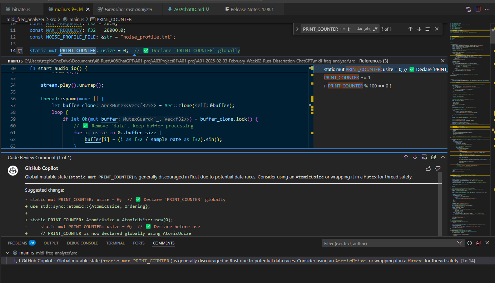

# Chat

## Description

Steps in commit to fix thread lock on thread with buffer which is poisoned

using mutual exclusion, mutex keyword and concurrency.

## import Suggestions from Chat

____

🔧 Fix: Add this at the top of main.rs:

rust
Copy
Edit
static mut PRINT_COUNTER: usize = 0;  // ✅ Declare `PRINT_COUNTER` globally
🚀 Now PRINT_COUNTER is recognized.

____

Note on PRINT_COUNTER

Global mutable state (static mut PRINT_COUNTER) is generally discouraged in Rust due to potential data races. Consider using an AtomicUsize or wrapping it in a Mutex for thread safety.

